# 🌊 Living Aquarium

Интерактивная экосистема на **Canvas 2D**, написанная на чистых HTML, CSS и JavaScript. Никаких библиотек, сборки и внешних ассетов: откройте `index.html` — и аквариум оживает.



<p align="center"><b>🐠 Boids · 🦈 Predator AI · 🌊 Caustics · 🎵 Web Audio · 💾 LocalStorage · 📱 Responsive</b></p>

## ✨ Возможности

- 🐠 Реалистичная модель **Boids по Craig Reynolds**: разделение, выравнивание и сплочение с локальным радиусом соседства, ограничением силы и инерцией.
- 🐟 Пять визуально разных видов: неоны, золотые рыбки, танги, гуппи и скалярии.
- 🦈 Хищник использует упреждающее преследование, выбирает ближайшую цель и избегает стен.
- 👆 Клик или касание создаёт двухсекундную волну паники.
- 🍽️ Хлопья падают сверху; рыбки переключают приоритет и плывут к корму.
- 🌊 Динамическая каустика, частицы воды и градиентная глубина.
- 🫧 Пузырьки с радиальным преломлением, бликами и естественным дрейфом.
- 🌱 Растения растут и колышутся на плавном value-noise.
- 🪸 Процедурные кораллы и 🪨 камни с мягкими тенями.
- 🦐 Креветки и 🐌 улитки живут и перемещаются на дне.
- 🌙 Ночной режим затемняет воду и замедляет экосистему.
- 🎵 Процедурный шум воды через Web Audio API — без аудиофайлов.
- ⚙️ Панель настройки весов Boids, скорости, пузырьков и каустики.
- 💾 Количество и виды рыб, режим и настройки сохраняются в LocalStorage.
- 📱 Адаптивный HUD, touch-события и safe-area для мобильных устройств.
- 🚀 GitHub Actions автоматически публикует `main` в GitHub Pages.

## 🚀 Запуск

```bash
git clone https://github.com/Onmaynec/Aquarium.git
cd Aquarium
python -m http.server 8080
```

Откройте `http://localhost:8080`. Можно также просто открыть `index.html` в современном браузере.

## 🎮 Управление

| Элемент | Действие |
|---|---|
| Клик / касание воды | Рыбы разбегаются от точки на 2 секунды |
| `🍽️ Покормить` | Создаёт падающие хлопья |
| `🐟 Добавить` | Добавляет случайный вид рыбы |
| `🌙 Ночь` | Переключает день и ночь |
| `🔊 Звук` | Включает процедурный шум воды |
| `⚙️` | Открывает параметры симуляции |
| `💾 Сохранить` | Записывает экосистему в LocalStorage |

## 🧠 Модель поведения

Для каждой обычной рыбки рассчитывается сумма управляющих сил:

```text
acceleration =
  separation × separationWeight +
  alignment  × alignmentWeight  +
  cohesion   × cohesionWeight   +
  predatorAvoidance + wallAvoidance + foodSeeking + panic
```

Скорость ограничивается отдельно от силы поворота, поэтому рыбки сохраняют инерцию. Хищник целится в прогнозируемую позицию добычи с учётом её скорости.

## 📁 Структура

```text
Aquarium/
├── index.html                  # симуляция, интерфейс, стили и звук
├── README.md                   # документация
├── docs/demo.svg               # анимированное превью
└── .github/workflows/pages.yml # автоматический GitHub Pages deploy
```

## ⚙️ GitHub Pages

Workflow запускается при каждом push в `main`. В репозитории выберите `Settings → Pages → Source → GitHub Actions`. После успешного deploy сайт будет доступен по адресу:

`https://onmaynec.github.io/Aquarium/`

## 🛠️ Технологии

`Canvas 2D` · `requestAnimationFrame` · `Web Audio API` · `LocalStorage` · `Pointer Events` · `CSS Backdrop Filter` · `GitHub Actions`

## 📄 Лицензия

Проект доступен для обучения, экспериментов и развития. Добавьте файл лицензии перед коммерческим распространением.
